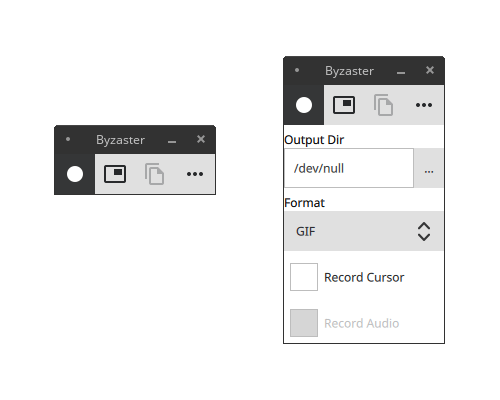

# Byzaster

GUI for Byzanz screen recorder. It's similar to JScreencaster, but supports video format option (GIF/FLV/WEBM), sound recording flag, can copy the recorded file to the clipboard, and doesn't depend on Java runtime.

## Building

Open the project in QTCreator, choose GCC kit, build for release.

Alternatively, build from command line:

    mkdir build
    cd build
    qmake ../byzaster.pro -spec linux-g++ CONFIG+=qtquickcompiler
    make

If the build fails due to an old Qt version, call qmake from a newer distribution instead, e.g.:

    /opt/Qt/5.12.3/gcc_64/bin/qmake ../byzaster.pro <...>

For recording to work, Byzanz needs to be installed separately, e.g. for Ubuntu

    apt-get install byzanz

## Credits

Package icon from [Zafiro icons](https://github.com/zayronxio/Zafiro-icons/) ([GPL v3](https://github.com/zayronxio/Zafiro-icons/blob/master/LICENSE.md))
UI icons from [Material icons](https://material.io/) ([Apache 2.0](https://www.apache.org/licenses/LICENSE-2.0.html))
